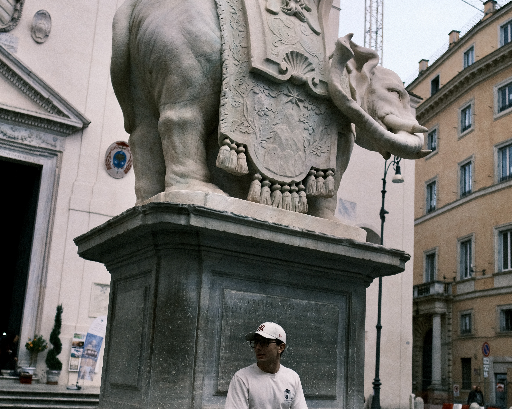

# Matteo Cavallo

## About

_Crafting interfaces_. Building mobile and web experiences since 2017. I've been always passionate about technology and I am always seeking out ways to improve my skills and knowledge in this constantly evolving industry. Frontend Engineer at [Soldo](https://www.soldo.com/en-gb/).

Developing skill through doing, guiltlessly exploring passion and interests, imbuing quality. Mindful that _everything around me is someone’s life work_.

Indulging in mellow, serene jazz tunes: tracks that establish their rhythm within the initial moments and sustain it throughout the next ten minutes. [Tutu](https://open.spotify.com/playlist/37i9dQZF1E8E9TytigkU3f?si=9d6b6caecb2a4965) is a curation of my favorites.

## Work Experience

- Frontend Software Engineer at Soldo

  _Rome, IT & London, UK (March 2021 - Present)_

  - Leading the development of the mobile React Native UI kit and components library for the application, I collaborate closely with the design team to bring their visions to life while streamlining the developers' experience.
  - Coach junior developers, conducting frequent pair and mob programming sessions, while working with senior engineers to define roadmaps and feature priorities.

- Backend Software Engineer at NTTData

  _Rome, IT (March 2020 - August 2020)_

  - Implemented and executed comprehensive unit and integration testing
    methodologies for backend functionalities using Spring Boot framework,
    resulting in a substantial decrease in system errors.

## Projects

- [EtnaUI](https://github.com/matteomad1011/etna-ui?tab=readme-ov-file)
  Open source React Components Library

- Soldo Mobile UI Kit (Wrote about it on [Medium](https://medium.com/@m.cavallo1011/a-journey-in-monorepo-architecture-for-a-react-native-ui-kit-part-1-inception-a7298171f689))

- [Simple Merge Reducers](https://www.npmjs.com/package/simple-merge-reducers)
  is a utility function which helps merging more redux reducers together.

- [Code-Pilot](https://www.npmjs.com/package/simple-merge-reducers)
  CLI ChatGPT wrapper which helps you find bugs and provides hint and suggestions.

- [MyTicket-BE](https://github.com/matteo-cavallo/myticket-be), [MyTicket-FE](https://github.com/matteo-cavallo/myticket-fe) provide functionalities to manage events and tickets.

## Education

- BSc in Computer Science at Polytechnic University of Milan

  _September 2019 – July 2022_

## Awards & Honors

- Soldo Legacy Builder
  _2023_

  _“Recognises an individual, group or team, who have chased the most complex problems. Questing constantly. They never give up. They dare. They test. They learn. They create. They share what they've learned.”_

## My Journey

### 2017

- 🎥 Developer and video maker at [Editions SRL](https://www.editions.it/)
- 🎵 Crafted videos for emerging music talents
- 💻 Web Developer at [KDS](https://www.konsol.it)

### 2018

- 🛠️ ENAC Certified - Drone Building and Repairing
- 📱 Published Yeezy on Google Play Store, featured on [_Outpump_](https://www.instagram.com/outpump/)
- 🌍 Achieved English Cambridge B2 Certification
- 🎮 Launched _Do100!_ on Google Play Store

### 2019

- 🏆 Winner of _Bologna Festival Il Cinema Ritrovato_
- ✈️ Explored self-driving drone projects in Bordeaux and Istanbul with Erasmus+
- 📚 Embarked on a BSc in Computer Science at [Politecnico di Milano](https://www.polimi.it/)
- 🖥️ Cisco CCENT RSE Certified
- 🚲 Navigated London's streets as an Uber Eats rider

### 2020

- ☁️ Amazon AWS Foundation Course
- ☕ Java OCA Course
- 💼 Internship at NTTData
- 🌐 Developed [Avvento ELIS](https://github.com/matteo-cavallo/avvento-elis): a video content-sharing web app

### 2021

- 🌐 Completed a Web Development Course
- 👨‍💻 Became a Part-Time Frontend Software Engineer at Soldo
- 🐳 Introduced to Docker Course
- 📱 Dived into Flutter Mobile Development
- 👨‍💻 Continued as a Frontend Software Engineer at Soldo

### 2022

- 📱 Promoted to Mobile Software Engineer at Soldo
- 🎓 Graduated with a BSc in Computer Science 🎉
- 🗼 Visited Paris for the first time!

### 2023

- 🏃‍♂️ Conquered the _London Tough Mudder_ 15K marathon
- 🚀 Participated in _Italy Tech Week_
- 🚀 Joined the _Vento Builder Program_ Bootcamp
- 🛠️ Led the development of the Soldo Mobile UI Kit
- 🏆 Awarded the _Soldo Legacy Builder_

### 2024

- 🇬🇧 Moved to London
- ...

## Books

- Delivering Happiness - _Tony Hsieh_
- The Lean Startup - _Eric Ries_
- The personal MBA - _Josh Kaufman_
- ...

